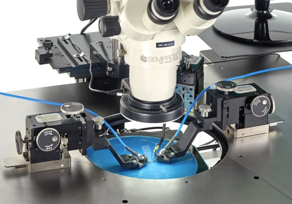

## I-V and Time-Dependent Photocurrent Measurements



Current-Voltage (I-V) characterization and time-dependent photocurrent measurements are essential diagnostic tools in semiconductor device development and quality control. I-V curves reveal crucial device parameters such as breakdown voltage, leakage current, and contact resistance, which directly impact device performance and reliability. Time-dependent photocurrent analysis provides insights into carrier dynamics, trapping effects, and photoresponse stability - critical factors for optoelectronic applications like photodetectors and solar cells. Together, these measurements enable researchers and manufacturers to optimize device designs, validate fabrication processes, and ensure consistent performance standards across production batches. In the rapidly evolving semiconductor industry, where device miniaturization and performance demands continue to increase, these characterization techniques remain fundamental for developing next-generation electronic and photonic technologies.

## About this app
A Streamlit web application for analyzing and visualizing IV (Current-Voltage) and I-t (Current-Time) curves from CSV raw data files.

## Features

- Upload and analyze multiple CSV files simultaneously
- Interactive plot visualization using Plotly
- Adjustable plot parameters:
  - Line width
  - Marker size
  - Time range selection
  - Pulse start alignment
  - Threshold adjustment
- Raw data viewing capability for each uploaded file
- Responsive plot layout with customizable dimensions

## Local installation

1. Clone this repository:
```bash
git clone <repository-url>
```

2. Install required dependencies:
```bash
pip install -r requirements.txt
```

3. Run the Streamlit app:
```bash
streamlit run app.py
```

4. Open your web browser and navigate to the provided URL (typically http://localhost:8501)

## Using the application
  - Upload one or more CSV files using the file uploader
  - Adjust visualization parameters in the sidebar:
  - Interact with the plot (zoom, pan, hover for details)

## Input File Format

The application expects CSV files with the following columns:
- `Time (s)`: Time values in seconds, for I-t analysis
- `Voltage (V)`: Applied bias voltage, for IV analysis
- `Current (A)`: Current values in amperes, for both I-t and IV

Comments in the CSV files should be preceded by '#'.

## Requirements

- Python 3.7+
- Streamlit
- Pandas
- NumPy
- Plotly
- Scipy


